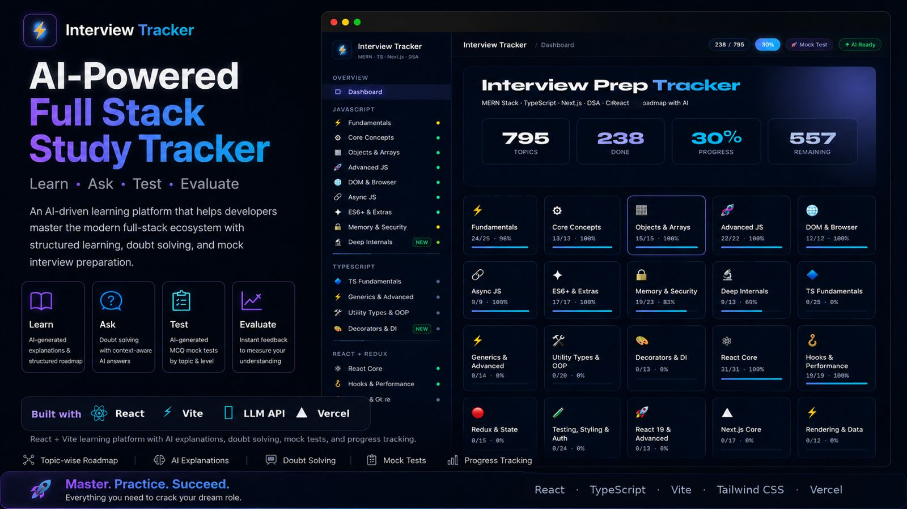

# AI-Powered Full-Stack Study Tracker

A personal learning and exam-preparation tool I built to study modern full-stack development in a structured way.

---

## About the Project

I originally built this project for myself while preparing for the **Full Domain 2** module at Brototype.

The module included an interview-style evaluation covering a wide range of modern full-stack development topics. Preparing for it required studying JavaScript, React, TypeScript, data structures and algorithms, and other important web-development concepts.

The learning resources were spread across documentation, websites, videos, and personal notes. To make my preparation easier, I created one application where I could:

- Follow a structured list of topics
- Generate explanations using AI
- Ask questions about individual concepts
- Take topic-based mock tests
- Track my learning progress

After using the tracker myself, I shared it with other students preparing for the same evaluation. It became a helpful study resource for them as well.

The response to this project later helped me recognize a larger problem: learners need structured study trackers for many different technologies and subjects. That idea eventually became the starting point for **Imminiq**.

---

## Why I Built It

Preparing for a broad technical evaluation can become difficult when:

- The syllabus contains many different topics
- Learning resources are scattered across multiple platforms
- It is difficult to track completed and remaining topics
- Learners need quick explanations for unfamiliar concepts
- There is no simple way to test their understanding

I built this application to bring the important parts of my preparation into one place.

It was not created as a large commercial learning platform. It was a practical tool built to solve a real learning problem I was facing.

---

## Learning Flow

The application combines four stages of learning:

| Stage | Purpose |
|---|---|
| Learn | Follow a structured full-stack learning roadmap |
| Understand | Generate AI explanations for individual topics |
| Ask | Get context-based answers for doubts |
| Test | Take dynamically generated MCQ tests |

A learner can select a topic, study its explanation, ask questions, mark progress, and test their understanding.

---

## Main Features

### Structured Study Roadmap

- Topic-based full-stack learning structure
- Organized coverage of modern development concepts
- Simple progress tracking
- Clear separation between completed and remaining topics
- Easy navigation between learning areas

### AI-Generated Explanations

- Generate explanations for individual topics
- Simplify unfamiliar technical concepts
- Study without leaving the tracker
- Configure the AI service using a personal API key

### Topic-Based Doubt Solving

- Ask questions within the context of a selected topic
- Receive focused AI-generated answers
- Understand difficult concepts without switching between multiple tools

### Mock Tests

- Generate multiple-choice questions dynamically
- Select a topic and difficulty level
- Choose the number of questions
- Submit answers and receive immediate results
- Evaluate understanding before moving to the next topic

---

## Topics Covered

The tracker includes topics from areas such as:

- JavaScript
- React
- TypeScript
- Next.js
- Data Structures and Algorithms
- Modern frontend development
- Full-stack development concepts
- Interview preparation topics

The roadmap was mainly organized around the concepts I needed to prepare for during my Full Domain evaluation.

---

## Tech Stack

| Layer | Technology |
|---|---|
| Frontend | React |
| Build Tool | Vite |
| AI Integration | User-provided LLM API key |
| Deployment | Vercel |

This is primarily a frontend project. It does not currently include a dedicated backend, database, or user-authentication system.

---

## How It Works

1. Open the application
2. Configure an AI API key through the setup section
3. Select a topic from the roadmap
4. Generate an explanation
5. Ask questions when clarification is needed
6. Mark the topic as completed
7. Take a mock test
8. Review the result and continue learning

---

## Installation and Setup

### 1. Clone the Repository

```bash
git clone https://github.com/arjunpj-11/MERN-Advanced-Tracker
cd MERN-Advanced-Tracker
```

### 2. Install Dependencies

```bash
npm install
```

### 3. Start the Development Server

```bash
npm run dev
```

### 4. Configure the AI Service

After opening the application:

1. Open the setup section
2. Enter a supported AI API key
3. Save the configuration
4. Start using the explanation, doubt-solving, and mock-test features

> Do not expose or commit personal API keys to the repository.

---

## What I Learned

This project helped me improve both my technical knowledge and my understanding of how software can solve a personal problem.

While building it, I worked with:

- React component development
- Vite project setup
- State management
- Conditional rendering
- Progress-tracking logic
- API integration
- AI prompt handling
- Dynamic question generation
- MCQ evaluation logic
- Browser-based configuration storage
- React application deployment using Vercel

More importantly, this project showed me that a tool created for one learner could also help other people facing the same problem.

---

## From This Project to Imminiq

This tracker was initially created for one specific goal: helping me prepare for a full-stack development evaluation.

After I shared it, other learners requested similar trackers for technologies such as Python and Django. Creating every tracker manually would not be scalable.

That experience led to a new question:

> What if learners could enter any learning goal and automatically receive a structured tracker for it?

That question became the starting point for **Imminiq**, which later evolved into a larger AI-assisted and community-evolving learning platform.

---

## Current Limitations

- Progress is not synchronized across devices
- There is no user authentication
- There is no dedicated backend or database
- Users must provide their own AI API key
- AI-generated explanations and questions may sometimes be inaccurate
- The roadmap mainly focuses on the topics required for my original preparation

These limitations also helped me identify several problems that I later worked on while developing Imminiq.

---

## Possible Improvements

- User authentication
- Database-backed progress storage
- Performance analytics
- Additional learning roadmaps
- Coding challenges
- Revision scheduling
- Saved mock-test history
- Better AI-response verification
- Improved mobile experience
- Personalized topic recommendations

---

## Repository Purpose

This repository is shared to showcase a personal study tool that I created for my own full-stack preparation and later shared with other learners.

The project represents an important step in my development journey and the original idea that eventually led to Imminiq.

---

> Built first to help me study, then shared to help others preparing for the same journey.
